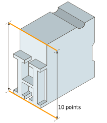
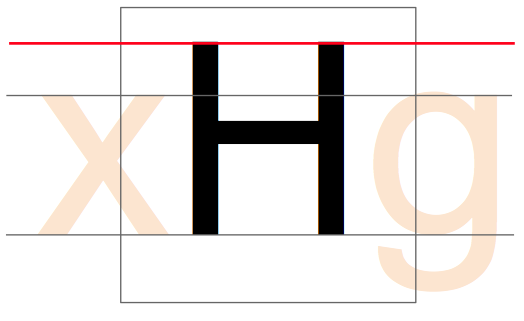

<!--
published: true
layout: bookpage
weight: 12
category: workflow
title: The EM Square
-->

<!--
&mdash; Also called the ‘em size’ or ‘UPM’.  
In a font, each character is fitted into its own space container. In traditional metal type this
container was the actual metal block of each character. The height of each character piece was
uniform, allowing the characters to be set neatly into rows and blocks (see below).
-->
em スクエアは、「em サイズ」とも、‘UPM’ とも呼ばれています。 
フォントでは、各文字がそれぞれ固有のコンテナに収まるように作られています。
伝統的な金属活字では、このコンテナは文字毎に作られた本物の金属ブロックでした。
各文字ブロックの高さは均一に作られていて、文字を行や段落にきれいに並べることができました（後述）。

<!--
The height of the type piece is known as the ‘em’, and it originates from the width of the uppercase
‘M’ character; it was made so that the proportions of this letter would be square (hence the ‘em
square’ denomination).  
The em size is what the point size of metal type is calculated upon. So, a 10 points type has a 10
points em (see below).
-->
活字ブロックの高さは ‘em’ と呼ばれています。
これは大文字の ‘M’ の幅に由来します。
そして、この文字の比率は正方形になるように作成されました（そのため「em スクエア」と呼ばれます）。 
em サイズは、金属活字のポイントサイズから計算されたものです。
したがって、10 ポイントの活字は 10 ポイントの em となります（後述）。
 

<!--
In digital type, the em is a digitally-defined amount of space. In an OpenType font, the UPM &mdash;
or em size is usually set at 1000 units. In TrueType fonts, the UPM is by convention a power of two,
generally set to 1024 or 2048.
-->
電子組版では、em は電算機上に定義された場所の大きさを表します。
OpenType フォントでは、UPM（em サイズ）は通常 1000 ユニットに設定されます。
TrueType フォントでは、UPM は慣例で 2 の累乗が用いられ、通常 1024 または 2048 に設定されます。

<!--
When the font is used to set type, the em is scaled to the desired point size. This means that for
10 pt type, the 1000 units for instance get scaled to 10 pt.
-->
フォントを使用した組版では、em は目的のポイントサイズにスケーリングされます。
つまり、10 pt で組版する場合、たとえば 1000 ユニットのフォントが 10 pt のサイズにスケーリングされるということです。

<!--
So if your uppercase ‘H’ is 700 units high, it will be 7 pt high on a 10 pt type.
-->
したがって、大文字 ‘H’ の高さが 700 ユニットのフォントの場合、10 pt の組版を行うと 7 pt の高さになるということです。

<!--
### Setting that up in the Glyph Window
-->
### グリフウィンドウでの設定

<!--
With the knowledge that your font is using a 1000, 1024, or 2048 UPM, you need to set up the drawing
of your glyphs to ensure that all aspects of your typeface fit adequately into that UPM square.
-->
フォントの UPM が 1000 か 1024、もしくは 2048 なのかを把握した上で、書体のすべてが UPM スクエア内に適切に収まるように、グリフの描画を設定する必要があります。

<!--
The size of the em square can be set from *Element > Font Info&hellip;* then click on the General
tab and you will see the *EM* setting, which value shall be distributed between the *Ascender* and
*Descender* heights, respectively heights above and underneath the baseline.
-->
em スクエアのサイズは、「要素 > フォント情報」から設定できます。
「全般」タブをクリックすると、
「EM」設定が表示されます。
この値は、「アセンダ」と「ディセンダ」の高さ（ベースラインの上下の高さ）に分配されます。

<!--
The Baseline:
-->
ベースライン:

<!--
The Cap Height:
-->
キャップハイト:

<!--
The x-height:
-->
エックスハイト:

<!--
Later when designing your type, you will have to set the Blue values which serve for PostScript
outlines and also for the FontForge autohinter &mdash; regardless of which outlines you are working
on.  
You will find the setting in *Element > Font Info&hellip;*, on the *PS Private* tab. FontForge can
initially guess the values based on your outlines, but you will have to edit them yourself for
overshoots/undershoots &mdash; we are a few chapters ahead of this concept (see 
[“Creating ‘o’ and ‘n’”]); let’s first get ahold of FontForge and its drawing functionalities.
-->
最後になりますが、書体をデザインする際には、（作業するアウトラインが何であっても）PostScript アウトラインと FontForge 自動ヒントで使用する BlueValues を設定する必要があります。 
設定は「PS プライベート」タブの「要素 > フォント情報」です。
FontForge は最初にアウトラインに基づいて値を推測することができますが、大きすぎたり小さすぎたりするので自分で修正する必要があります。
数章後にこのことについての説明があります（[‘o’ と ‘n’ の作成][“Creating ‘o’ and ‘n’”] を参照）。 
まずは、FontForge とその描画機能を理解しましょう。

[“Creating ‘o’ and ‘n’”]: Creating_o_and_n.html