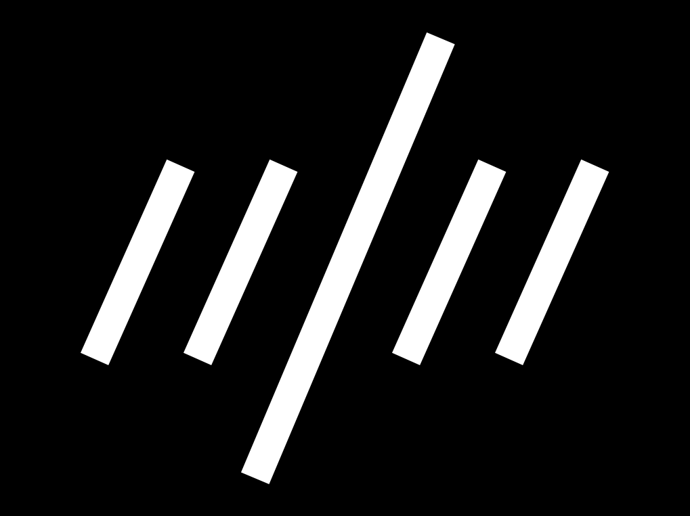

<!--
published: true
layout: bookpage
weight: 6
category: Before You Begin
title: Trusting Your Eyes
-->

<!--
Font design is the process of iteratively testing the individual choices that collectively add up to
a complete design. You will be testing your font to see if the combination of decisions you have
made:
-->
フォントデザインとは、一つ一つの選択肢についてテストを繰り返しながら、デザイン全体を完成させていく工程のことを指します。
フォントのテストでは、選んだ組み合わせが次のようになっているかを確認します。

<!--
* Allows you to read the font
* Makes the font feel right to you
* Makes the font useful for the the jobs you want the font to be able to do.
-->
* 読みやすいかどうか
* フォントの雰囲気がしっくりくるかどうか
* そのフォントを使うことで作業がはかどるのかどうか

<!--
As you test the design, you will have to trust your perceptions and design somewhat practically.
Much of type design requires that you make letters similar and that you repeat forms.
-->
フォントをテストするときは、自分の目の感覚とデザインはある程度信頼できるものと考える必要があります。
大抵の書体デザインでは、それぞれの文字を似たようなものにし、同じような形状を繰り返していくことが求められます。

<!--
It is tempting to assume that if you measure the parts and the spaces between the glyphs, then you
will get reliable results. While very useful, this approach has real limitations. You should expect
to make adjustments if something looks wrong to you. Furthermore, you should feel confident that
making changes until it “looks right” is the correct thing to do.
-->
グリフの部品や間隔を測定すれば信頼できる結果が得られるのではないかとよく思われます。
とても便利ではあるのですが、このようなやり方は実際には限界があります。
どこかがおかしいと感じたなら、調整したほうがよいでしょう。
さらに、「正しく見える」まで変更しつづけることが正解であると信じることが必要です。

<!--
The reason this is true is that there are a number of natural optical illusions that all readers are
subject to. These illusions must be accounted for by altering the shapes of letters until they look
right to you.
-->
その理由は、どんな読者にもたくさんの錯視が生じているからです。
自分にとって正しく見えるようになるまで文字の形を変更し、錯視を打ち消す必要があります。

<!--
You can get a feel of where to look and what elements to adjust in these [Type Review Videos](https://vimeo.com/typereview/videos) (External Link)
-->
[Type Review 動画](https://vimeo.com/typereview/videos)（外部リンク）を見れば、フォントの調整を行うためにはどこを見て、どの要素を対象とすればよいかを知ることができます。

## Examples of illusions

Some illusions involve the perceived weight of lines, some involve the perceived length of lines,
and others involve the eye’s perception of shapes.

### Horizontal vs. vertical weight

The example on the left shows an ‘H’ which bars are precisely equal in thickness. This looks wrong.
Can you feel it?  
The other one on the right has a horizontal bar which has been thinned to appear equal in
thickness.

Glyphs in which optical adjustments have to be made are numerous and include A, E, F, L, H, f, t,
and z.

### Diagonal thickness

Similarly, if you have bars of the same width and one of them is set at a diagonal, the diagonal bar
will seem slightly heavier than the vertical bar and slightly thinner than the horizontal. If you
want it look right, you will have to adjust it to be lighter like the horizontal example, but just a
little less.

Glyphs in which this human perception may be relevant are quite numerous but include k, K, N, Q, R,
v, V, w, W, x, X, y, Y, 7, 2, &amp;, ł, Ł, &oslash;, &Oslash;, &radic;, ∕, &lsaquo;, &rsaquo;,
&laquo;, &raquo;, ½, ⅓, ¼, &le;, &ge;, and &times;.

### Length and perceived diagonal angle

Longer shapes need to slant less than short shapes in order to give the appearance of same slant.

The image below has diagonal lines that are all at the same angle. The long one appears to be at a
different angle.

In the next picture below, the slant of the longer line has been adjusted:

Now let’s look at an actual italic, applying these corrections to the glyphs:

### Crossing diagonals

When a bar crosses another diagonal or a straight line, it will need adjustments to not appear as
misaligned.

In the example above, the X on the left has two unadjusted bars crossing each other. The example on
the right has been adjusted so that they appear to be aligned.

As you can see in this X with dotted line on top of it, the X that appears visually aligned involves an offset.

Glyphs in which this illusion is relevant include x, X, k, K, ×, #, and the icelandic letter ‘eth’
(&eth;).

### Perceived height

The shape of a glyph will contribute to how high it needs to be in order to look as if it is the
same height as the other glyphs. Round glyphs need to overshoot the height of flat glyphs by a
little bit. Glyphs which have pointier shapes will need to overshoot more. The sharper the shape,
the more it will need to overshoot in order to look correct.

In the image above, the top three shapes are unadjusted &mdash; that is, they have identical
heights. The three shapes on the bottom have been adjusted so that they appear more similar in
height.

This illusion is relevant for any glyph that has parts which are either round or pointy. These
include O, Q, C, S, A, V, W, and so on.

## You are fully qualified to correct for these illusions

Because you can see both the illusion and the effect of correcting for the illusion, you will be
able to make these corrections for yourself. You just have to trust your impressions.

## Test for fitness of purpose

Just like you are able to see optical illusions and correct them, you also have the ability to tell
if a font is working for the specific use (or uses) you may have in mind. That’s where you should
also trust your judgment.

Quite separately, it is worth noting that no font can be evaluated apart from the way it is used and
what it is used for. This is why it is essential to begin testing from the very beginning of the
design process, and to continue testing until you feel the project is done.

What will these tests be like? The tests will be simple at first, allowing you to test the first
design choices. As your design becomes more complete, your tests will need to keep pace and let you
evaluate the relative success or failure of the newest choices you have made &mdash; or, even
better, to compare two (or three, or more&hellip;) options you are considering.

Sometimes you will find you have to double back and change a design choice you thought was already
working well. This is normal. Making a font requires balancing many variables, and surprises often
occur. The more you design fonts, the more experience you will have in making these arbitrary
choices.

When nearing the end of the process, if the font is to be used in a simple way, the tests should
also just stay simple. However, if a font is to be used in many ways or in a wide range of printing
or screen environments, then it should be tested across all that range of situations, which includes
printing various samples of the font.

It can save you design time to have a well defined idea of the final use you intend. However, this
is not always possible and your ideas may evolve. The key thing is to think about and define the use
cases as completely as you can, then to ensure that your tests keep pace with the questions you are
asking yourself while designing the font.

## Further Reading

* <http://typographica.org/on-typography/making-geometric-type-work/>
* <http://typedrawers.com/discussion/1085/the-letter-s>
