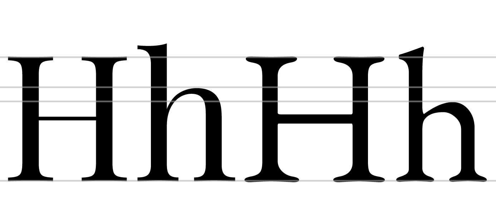
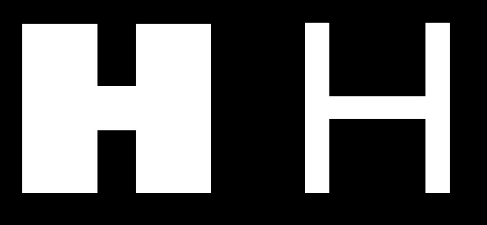
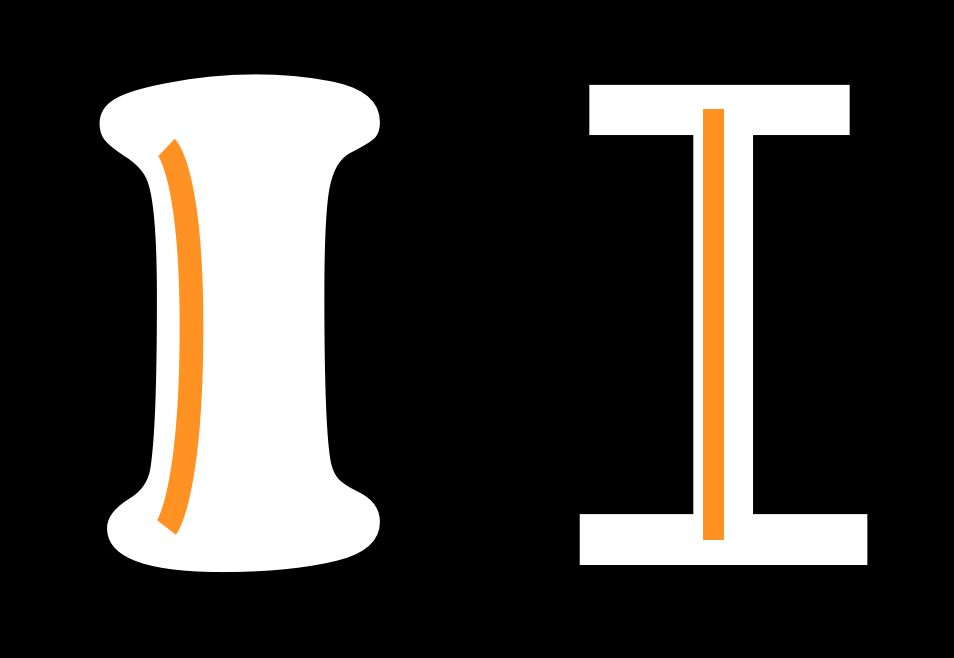
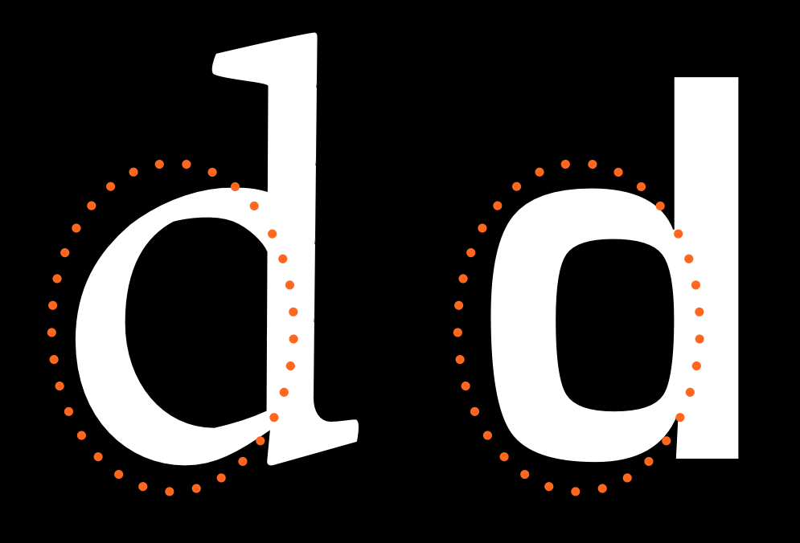
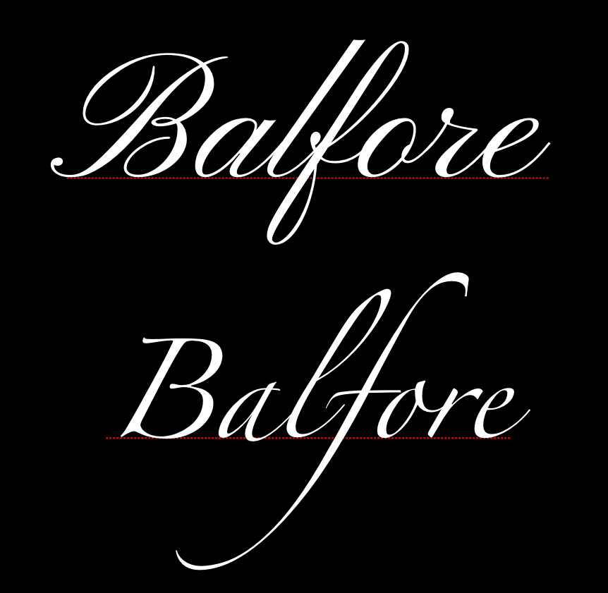
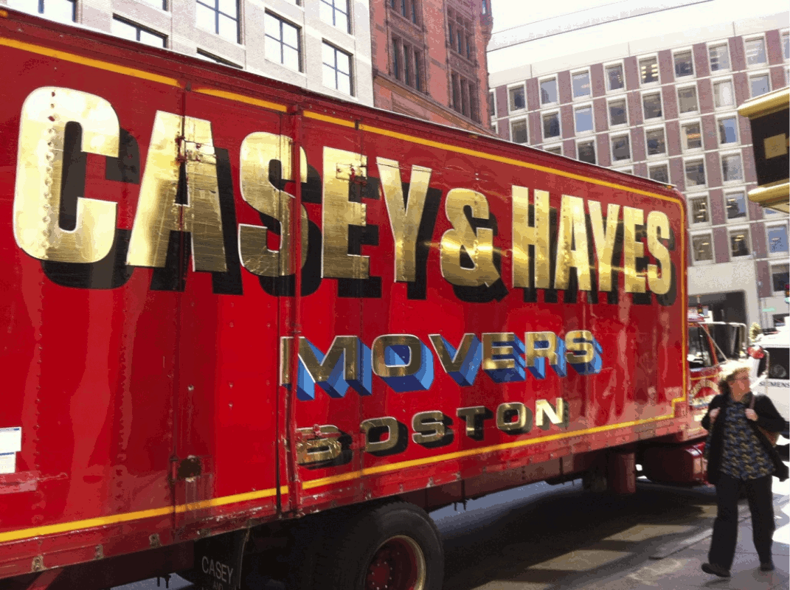

<!--
published: true
layout: bookpage
weight: 3
category: Before You Begin
title: What Is A Font?
-->

<!--
What makes typefaces different from hand-writing, calligraphy, lettering, and logos?
-->
書体というものは、手書き、カリグラフィー、レタリング、ロゴと比べて何が違うのでしょうか？

<!--
The single biggest issue that makes type design different is the need for every glyph in the
typeface to work with every other glyph. This often means that the design and spacing of each part
of the typeface ends up being a series of careful compromises. These compromises mean that we can
best think about typeface design as the creation of a wonderful collection of letters but not as a
collection of wonderful letters. In other words we must think about the group and how it will
perform together and prioritize this over any question of what is wonderful in a single letter.
-->
書体デザインが他のものと最も大きく違う箇所は、書体に含まれるすべてのグリフは他のすべてのグリフと連携する必要があることです。
それは多くの場合、書体の各部のデザインと間隔は、慎重に妥協を重ねてきた結果として生み出されたものであることを意味します。
こうした妥協が意味することは、書体デザインとは、単に美しい文字を集めたというものではなく、文字が美しく集まったものを創造することである、という解釈がふさわしいということです。
別の言い方をするなら、私たちは文字の集まりというものを考えなければならず、単一の文字について何が美しいかという課題よりも、文字の集まりが互いにどのように振る舞うかということを優先する必要があります。

<!--
This need to prioritize with the system rather than with any single part also leads to a need to
analyse our design process on the level of the system. Characteristics which span letters become the
things we want to focus on, particularly at the beginning of the design process.
-->
個々の部品よりもシステム全体が優先されるため、システムのレベルでデザインの工程を分析する必要が生じます。
複数の文字にまたがる特性は、特にデザイン工程の初期段階で、私たちが注目するべき項目になります。

<!--
The other oddity in type design is that, to a very large extent, the forms we are designing are
already significantly established. Our task as type designers is not so much to create an utterly
new form but rather to create a new version of an existing form. This can perplex new type
designers. Finding just the right amount to change in order to excite but not to alienate a reader
is a tricky thing. Often designers get stuck in letter-specific thinking. This mistake can be easily
avoided if you realize from the start that what is most meaningful in a typeface are the parts of it
that repeat the most. Typeface design is not just about designing the characteristics applied to the
common forms we all recognize, but also to the forms that occur most often.
-->
書体デザインには他にも変わった点があり、非常に多くの場合で、私たちがデザインしようとしている形状というものが、すでにかなり確立したものであるということです。
書体デザイナーとしての私たちがすべきことは、まったく新しい形状を作成することではなく、すでにある形状の新しいバージョンを作成することです。
このことははじめたばかりの書体デザイナーを困惑させるかもしれません。
すばらしくはあるけれども読者を置いてきぼりにしないような、ちょうどよい変更量を見つけることは巧妙な技術です。
しばしば、デザイナーは単独の文字に意識を奪われてしまいます。
書体で最も意味があるものは最も頻繁に繰り返される部分だということに最初に気づいておけば、この間違いは簡単に回避できます。
書体デザインとは、単に私たちの誰もが認識している一般的な形状に適用される特性をデザインするのではなく、最も頻繁に発生する形状に適用される特性をデザインすることです。

<!--
It is also useful to recognize that these characteristics not only help to create a font’s voice or
atmosphere, but also to determine what the font will or will not be useful for, and sometimes to
determine the technological contexts for which a font is suitable.
-->
これらの特性は、フォントの声や雰囲気を作り出すのに役立つだけでなく、フォントが何に役立つか、または役に立たないかを判断するのに役立ち、ときにはフォントが適している技術的な状況を判断するのにも役立ちます。

<!--
It may seem intimidating or excessively abstract to think about the design of a font in this way.
However, getting used to these ideas is the key to a faster, more effective, and satisfying type
design process.
-->
このようにフォントのデザインを考えることは、押し付けがましく感じたり、抽象的に過ぎるように思えるかもしれません。
ですが、こうした考えに慣れておくことは、書体デザインの工程をより速く、より効果的に、かつ満足いくものとするための鍵となります。

<!--
Let’s begin by identifying the main systemic characteristics in type design.
-->
それでは、書体デザインにおける主要なシステム特性について見ていきましょう。

<!--
### Construction
-->
### 構造

<!--
Construction refers to the structure of the underlying strokes that form a particular glyph. Perhaps
you can imagine the glyph’s skeleton. The kind of construction to use is arguably one of the most
important questions to think about, because the construction affects so many of the remaining
choices, particularly if your design is going to feel somewhat familiar to readers. In the example 
above, the white line inside the letters indicate the approximate construction suggested by the shape 
of the letters themselves.
-->
「構造」とは、個々のグリフを形成する基本的なストロークの構造を指します。
おそらく、グリフの骨格が想像できるのではないかと思います。
どのような構造を使用するかを考えることは、最も重要なことの一つです.
なぜなら、使用した構造は残りの選択肢の多くに、あなたのデザインが読者にとってある程度馴染みがあるような場合は特に、影響を与えるためです。
上の例では、文字の中の白い線が、文字そのものの形状から推測されるおおよその構造を示しています。

<!--
However, the way strokes end (the ‘terminals’) and the ‘serifs’ (see below) are generally not part
of what is meant by ‘construction.’ Construction is the skeleton of the glyph, while rest &mdash;
width, weight, terminals &mdash; are all parts of the flesh.
-->
ただし、ストロークの「終端」と「セリフ」（以下を参照）は、一般に「構造」が指す部分には含まれません。
構造はグリフの骨格に該当し、残りの部分である幅、ウェイト、終端はグリフの肉付きに該当します。

<!--
### Proportion of X-height to Cap-height
-->
### エックスハイトとキャップハイトの比率

<!--
The letters on the left come from [Playfair Display], which has a large x-height relative to its
cap-height. The letters on the right are from [EB Garamond], which has a smaller x-height. In the
sample above, the size of the H has been adjusted so that they match.
-->
左の2つの文字は [Playfair Display] で、キャップハイト（cap-height, 大文字の高さ）に対して大きなエックスハイト（x-height, 小文字のxの高さ）が設定されています。
右の2つの文字は [EB Garamond] で、小さなエックスハイトが設定されています。
上の例では、H のサイズが一致するように調整されています。

<!--
### Ascender Height
-->
### アセンダの高さ

<!--
In the example above, the x-heights have been matched in order to illustrate the relative difference
in ascender heights.
-->
上の例では、アセンダの高さの相対的な違いを示すために、エックスハイトを一致させています。

<!--
Ascenders usually exceed the cap-height by at least a little, especially in text designs. In some
cases, however, they can match or even be lower than the cap-height. Longer ascenders can add
elegance to the look of a typeface. They often go with smaller x-height.
-->
アセンダは通常、特にテキストデザインにおいては、キャップハイトよりも少し大きくなります。
ただし、場合によっては、キャップハイトの高さと一致することもあります。
長いアセンダは、書体の外観に優雅さを加えることになるでしょう。
そうした場合は大抵、エックスハイトは小さくなります。

<!--
### Descender depth
-->
### ディセンダの深さ

<!--
Like ascenders, descenders that are long can feel elegant. 
-->
アセンダと同じように、長いディセンダには優雅さが感じられます。

<!--
Taken together, long ascenders and descenders can become difficult to manage. If the typeface will
be used with small line heights, the elongation means letters can collide across rows of text.
-->
長いアセンダとディセンダは管理が難しくなる可能性があります。
小さな行間で書体を使用する場合、上下に伸びが生じるということは文字がテキストの行と干渉するかもしれないということです。

<!--
## Width
-->
## 幅

<!--
The width of a type design will alter not just how it feels but also what it is useful for. The
example on the right is from a text face. The example on the left is from a display design meant to
be eye-catching. Letters that are more narrow than the text face example are also possible and can
be used to save space or to fit more text in a smaller space.
-->
書体デザインにおける「幅」は、それがどのように感じられるかだけでなく、それが何の役に立つかを変えることになります。
右側の例は、文章中で使用されているもので、
左側の例は、人目を引くことを目的としたディスプレイデザインのものです。
文章用の例よりも幅の狭い文字を使用することもでき、スペースを節約したり、より小さなスペースに多くの文章を収めたりするのに使用することができます。

<!--
### Width regularity versus variability
-->
### 幅の規則性と変動性

<!--
The letters in the top row of this example show a greater variety of width than do the letters in
the bottom row.
-->
この例で、上の行の文字は、下の行の文字よりも各文字の幅の変動が大きいことを示しています。

<!--
### Weight
-->
### ウェイト

<!--
### Slant
-->
### スラント

<!--
### Contrast
-->
### コントラスト

<!--
Contrast refers to how much variation in stroke width is found within a glyph. Notice in the below
two ‘O’ glyphs that the one on the left has much greater variability in line thickness between the top
and sides of the glyph. Both glyphs have some contrast, but the one on the left has much more than
the one on the right.
-->
コントラストとは、グリフ内でのストローク幅の変動がどれだけあるかを示すものです。
下の2つの ‘O' のグリフに着目すると、左側のグリフの方が、上部と側面の線における太さの変化がはるかに大きいことに気づくでしょう。
両者のグリフにはある程度のコントラストがありますが、左側のグリフには右側のグリフよりもずっと強いコントラストが設定されています。

<!--
Type with consistent weight (stroke width) in its letterforms or no visible contrast produces a
sheer distinction from contrasted type. Like the choice between serifs or sans-serifs, contrast is
an early choice of type design. It is interesting to note that ‘slab’ serif designs generally use
consistent stroke width in their letters, and that the design of slab serifs is not merely about the
serif, as it sounds! It must be remembered that the rules of perception apply (see [“Trusting Your
Eyes”](Trusting_Your_Eyes.html)) &mdash; contrast is about how the weight looks but not how it measures out to be.
-->
一貫性のあるウェイト（ストローク幅）を持った書体や、視覚的なコントラストを持たない書体は、コントラストを持つ書体とはまったく異なります。
セリフ体とサンセリフ体のどちらにするかという問題と同様に、コントラストは書体デザインの初期段階で選択する問題です。
「スラブ」セリフ体のデザインでは、通常、文字に一貫したストローク幅が使用されており、スラブセリフ体のデザインは、名前のような単なるセリフ体ではないという興味深い事実があります。
知覚的な規則が適用されるということに留意してください（[「目を信頼する」](Trusting_Your_Eyes.html)を参照）。
コントラストはウェイトの見え方を示すものであって、計測した結果ではありません。

<!--
### Angle of contrast
-->
### コントラストの角度

<!--
In the below image, we see that the thin parts of the lower case letter ‘o’ shapes are different. In
the glyph on the left, the thin points lie on a perfectly vertical axis. In the glyph on the right,
the axis is diagonal.
-->
下の画像では、小文字の ‘o’ の細い部分が異なっていることがわかります。
左のグリフでは、細い箇所は完全に垂直な軸にあり、右のグリフでは、対角の軸にあります。

### Weight distribution

If your font uses very little to no contrast, you don’t really need to think of it.  
Most fonts, however, have at least some degree of contrast. In these cases, you have a wide variety
of options to choose from when it comes to how to distribute the weight in your font.

#### Vertical

Vertical distribution of weight is very common. The 9 and 8 above are a particularly intense
example.

#### Horizontal

Horizontal weight distribution is much less common, but is nonetheless seen in many fonts.

#### Bottom-heavy

#### Top-heavy

#### Irregular

### Stems

It is easy to assume that your stems will simply be straight and that this isn’t a real concern, but
both the weight and the shape of your stems are things you can and should make deliberate choices
about.

### Joins

### Bowls

Note that bowls are the stroke part in the below illustrations and not the black inner forms. The
inner strokes are referred as “counters”. While designing type, you will often find yourself
altering your work not because of the shape or width of the stroke but due to the shape and size of
the counter.

### Terminals

Terminals are the end forms of the strokes. They are not same as the serifs. They are often
perpendicular to the angle of the stroke at its end, or sheared horizontally or vertically. They may
also reflect the shape of the nib or other mark-making tool that the letter forms evoke.

### Speed

The ‘n’ on the left seems to be written much faster than the one on the right. Speed is discussed in
more detail in the chapter [on italics].

### Regularity

The following characteristics are not present in all type designs, however they are variables that
may be a part of your design. If this is the case, it is worth considering the degree to which they
will play a role as a variable.

### Flourish

Notice that in the font on top the flourish is more present in the capital letter and the second one
the flourish is more in the lowercase.

### Serif - to be or not to be

Serifs are one of the most distinct aspects of a typeface, and often the first classification of
type is between serif and sans-serif type.

This choice affects how the end terminals will look like. Serifs can be two sided or one sided. They
can be perpendicular to stroke or have their own direction (like being always horizontal or
vertical). Serifs can be with or without brackets. Any serif design is a mix of all of the above
applied consistently to the type design with some deviations for particular letters, especially the
‘S’, ‘C’ and ‘Z’ (e.g. a type with horizontal serifs for all letters will often have s, c and z to
have vertical serifs).

There is a urban legend asserting that serif types are easier to read than sans-serifs &mdash; it is
[a sole myth](http://asserttrue.blogspot.se/2013/01/the-serif-readability-myth.html), until further
notice.

The form of the serifs are related to the forms of the terminals.

#### Brackets

The corner portions of a serif where it connects to the main stroke are called ‘brackets’. A
particular design may have them giving a soft feel to the serif ([Times New Roman] is an example) or
may choose to not have any bracket. Some designs also use brackets only on one side or with
different proportions on the two sides.

This is a relatively strong parameter that renders feel to the type &mdash; elegance (smooth or
large brackets of [Times New Roman]) or chunky crisp (absent brackets of [Arvo]).

#### Slab-serifs

Also called mechanistic or Egyptian type, slabs are thick, block-like serifs. Slab serifs don’t use
brackets. Generally speaking, type design with such serifs are seen to have less contrast in their
glyphs &mdash; [Rockwell], [Courier] or [American typewriter] reflect that.

It may be safe to assume that slab serifs have been used to add some ornament or rhythm to an
otherwise no-contrast type design. But this is not an absolute rule.

#### Serif Terminals

Just like letter terminals, the end shape of the serifs themselves contribute to the feel of the
type &mdash; either soft or chunky. Serif terminals can be soft and rounded ([Courier]) or blunt and
angular ([Rockwell]).

### Decoration

The letter forms themselves may be decorated inside, or they may be extended with superfluous decorative forms - or both!

### Dimension

[Playfair Display]: http://www.forthehearts.net/typeface-design/playfair-display/
[EB Garamond]: http://www.georgduffner.at/ebgaramond/
[“Trusting your eyes”]: Trusting_Your_Eyes.html
[on italics]: Italic.html
[Times New Roman]: http://practicaltypography.com/times-new-roman.html
[Arvo]: http://files.korkork.com/index.php?/fonts/arvo/
[Rockwell]: http://www.myfonts.com/fonts/mti/rockwell/
[Courier]: http://typedia.com/explore/typeface/courier/
[American typewriter]: http://www.myfonts.com/fonts/linotype/itc-american-typewriter/

